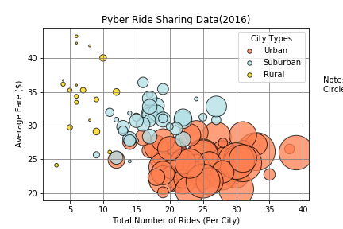
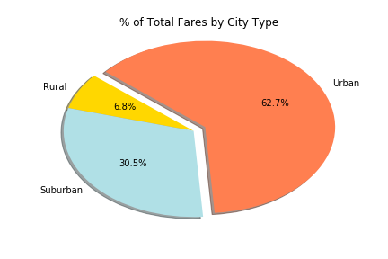
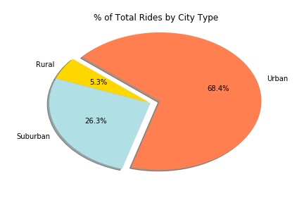
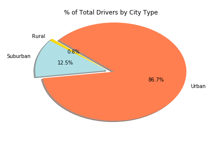

# HW5 | Assignment - Pyber

## Background
For this assignment we organized our rider and city data for Pyber to calculate counts, averages, and sums of Drivers, Fares, and Rides given in a city, whether it be Rural, Urban, or Suburban, to make meaningful plots to visualize the differences in the use of Pyber in those cities.

### Pyber Ride Sharing Data(2016)

For this scatter plot I calculated the total amount of rides (x-axis), the average fare(y-axis) and the driver count (for the size of markers in scatter plot) per city. The observations are below:
* There are more drivers in highly populated cities (Urban compared to suburbs adn Rural areas) and more rides given in highly populated cities as well.
* The average fare price for Rural cities are higher compared to Urban and Suburban, my guess is because they take a ride to the city which ends up costing more than traveling within the city.

### Pie Charts by City Type
The pie charts show the percentage of total fares, rides, and drivers by city type (Urban, Suburban, Rural). Below are the obserations, though they are very obvious.

* Urban and Suburban cities have a higher percentage of Fares

* Urban and Suburban cities have a higher percentage of Rides

* Urban and Suburban cities have a higher percentage of Drivers
